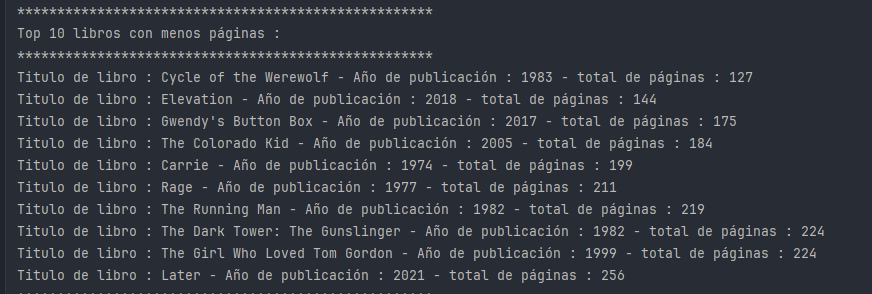

# Aplicación de Java y Spring Boot (consola)

#### La pliación se conecta a la web : https://stephen-king-api.onrender.com/

Una web para consumir informacion de libros, en el cual es posible extraer: el 
nombre del libro, año de publicación, páginas de cada libro, entre otros.

Capturas del top 10 de libros más largas en la web:

Captura de top 10 libros más pequeños segun su cantidad de paginas:

### Este es el codigo de conexión a la API

    public class ConsumoAPI {
        public String obtenerDatos(String url){
            HttpClient client = HttpClient.newHttpClient();
            HttpRequest request = HttpRequest.newBuilder()
                    .uri(URI.create(url)).build();
            HttpResponse<String> response = null;
            try{
                response = client.send(request,HttpResponse.BodyHandlers.ofString());
            }catch (IOException e){
                throw  new RuntimeException(e);
            }catch (InterruptedException e){
                throw new RuntimeException(e);
            }
            String json = response.body();
            return json;
        }
    }

### El modelo de datos (model) usado en este caso es:

    public record DatosLibros(
        @JsonAlias("Year") Integer anio,
        @JsonAlias("Title") String titulo,
        @JsonAlias("Publisher") String publicado,
        @JsonAlias("Pages") Integer pagin,
        @JsonAlias("Notes") List<String> notas
    ) {
    }
